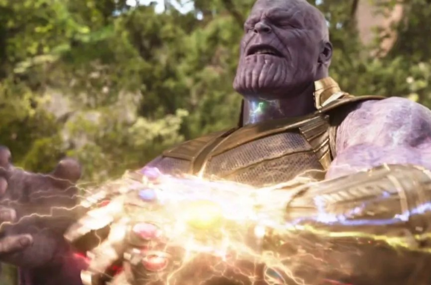

# Gauntlet-System-Validation - Flexors Sensor Controlled Robotic Hand 
The project brings these cinematic inspirations to life by creating a robotic hand that mimics natural human movements through a combination of Arduino R3 and C++ to control specific movements. This robotic hand is controlled by flex sensors worn on a glove, translating finger movements into servo-motor-driven articulation.

# Preview

This repository showcases a flex sensor-controlled robotic hand, inspired by iconic cinematic moments from the Marvel universe. Drawing creative energy from scenes like:

**Shang-Chi**: Father vs. Son's epic battle with the 10 Rings where Shag-Chi steals the rings from and power from his father, 

**Avengers: Endgame**: Thanos wielding the Infinity Gauntlet in the fight against Iron Man withholding all infinity stones,

**Black Panther**: The "I'm not dead" scene, symbolizes resilience and strength, ande

**Avengers**: Age of Ultron: The humorous yet profound team effort to lift Thor's Mjolnir (No one is able to lift Thor's hammer).

# Hardware

**Arduino Uno**: The brain of the system, processing inputs and controlling outputs.

**2.2-inch Flex Sensors**: To detect finger movements and translate them into electrical signals.

**Servo Motors**: To actuate the fingers of the robotic hand.

**10k Ohm Resistors**: As pull-down resistors for stabilizing sensor readings.

 **Fishing Strings**: Acting as tendons to pull the robotic fingers.
 
 **Elastic Rope**: Providing tension for returning fingers to their original positions.
 
**Glove**: A wearable interface for capturing the user’s movements.

**3D-Printed Arm Model**: To house the servos and mimic a realistic robotic arm.

# Function

- The flex sensors detect bending motion from the user’s fingers.
- 
- The Arduino interprets these readings sends signals to the servo motors, and utilizes PID to control the specific movements.
- 
- The servos pull on fishing strings to articulate the robotic fingers, while elastic ropes ensure the fingers return to their neutral position.
- 
- This setup replicates human-like finger movements with precision and realism, similar to the world of MCU, where Thanos is the main character.
  
# Purpose of this project

This project celebrates the themes of strength, resilience, teamwork, and ingenuity, all central to the cinematic scenes it’s inspired by in the Embedded World. It combines engineering with creativity to bridge the gap between fantasy and reality. The power between the communication between hardware and software CAN pose many possible problems in the world that can be interpreted the proper way through the power of the Marvel Universe. 

Feel free to contribute, modify, and build upon this project to take it to new heights!

